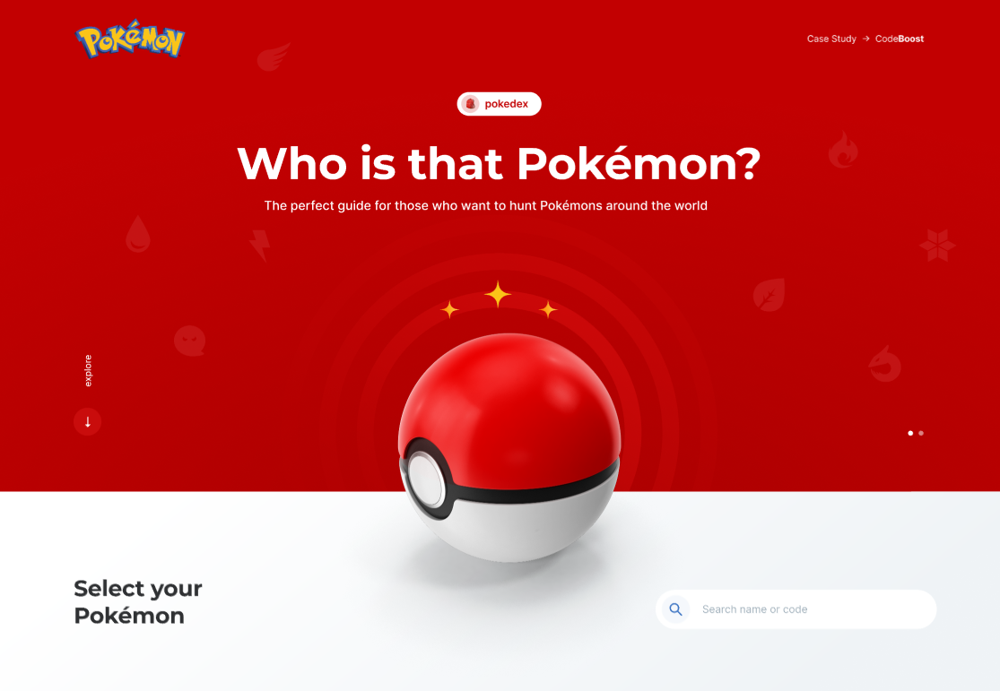

<h1 align="center"> Projeto - Pokémon </h1>

Desenvolvimento da página <strong>Pokémon</strong>  durante o curso CodeBoost, com o objetivo de praticar as tecnologias e aperfeiçar o acesso e manipulação de dados através de APIs, utilizando a PokeAPI.
 

  <a href="#-tecnologias">Tecnologias</a>&nbsp;&nbsp;&nbsp;|&nbsp;&nbsp;&nbsp;
  <a href="#-projeto">Projeto</a>&nbsp;&nbsp;&nbsp;|&nbsp;&nbsp;&nbsp;
  <a href="#memo-licença">Licença</a>

  

 

  

## 🚀 Tecnologias

Esse projeto foi desenvolvido com as seguintes tecnologias:

- HTML, SCSS
- JavaScript
- Axios
- Git e Github
- Figma
- WordPress

## 💻 Projeto

- [Visite o projeto online](https://charlesalmeiida.github.io/pokemon/)
